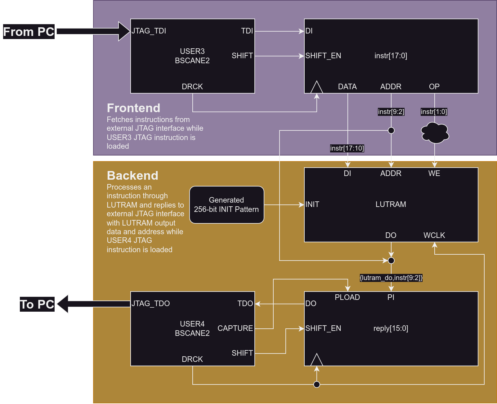

# LUTRAM Functional Test over JTAG

Development of this test is in progress.

This test is intended to validate functional aspects of LUT_OR_MEM BELs over JTAG.

## Block Diagram



## Tasks

- [ ] Add LUTROM primitives
- [ ] Verify shift register carry output port

## Default FPGA Target

By default, this test currently targets Sqrl Acorn CLE215(+) with Digilent HS2 JTAG cable.

## Supporting a New Target

The main requirements are the following:

- 7-series Xilinx FPGA
- JTAG cable (supported by OpenOCD)
- OpenOCD + telnet client 

Because JTAG TCK toggles clock to registers and the LUTRAM under test, there is no need to define
board/pin constraints (unless you want debug LEDs).

To support a new target, update the `FAMILY`/`PART`/`BOARD`/`JTAG_CABLE` variables in the Makefile,
or alternatively run make and override them as in the following example:

```
make FAMILY=kintex7 PART=xc7k325tffg900-2 BOARD=kc705 JTAG_CABLE=digilent ...
```

## Selecting LUTRAM and Generating the Bitstream

### Using Vivado Toolchain

> [!NOTE]
> Append make flag `DEBUG_LEDS=1` to enable optional debug LED status indicators.

To generate the bitstream with a specified LUTRAM cell using the Vivado toolchain, run the following:

```
make [PART=...] [XDC=...] LUTRAM=<LUTRAM_TYPE> vivadoclean top.vivado.bit
```

Available `LUTRAM_TYPE` options:

- Supported by Vivado:
    - LUT5
    - LUT6
    - LUT6_2
    - CFGLUT5
    - SRL16E
    - SRLC16E
    - SRLC32E
    - RAMS32
    - RAMD32
    - RAMS64E
    - RAMD64E
    - RAM32X1S
    - RAM64X1S
    - RAM128X1S
    - RAM256X1S
    - RAM32X1D
    - RAM64X1D
    - RAM128X1D
    - RAM32M
    - RAM64M

### Using OpenXC7 Toolchain

> [!NOTE]
> Append make flag `DEBUG_LEDS=1` to enable optional debug LED status indicators.

To generate the bitstream with a specified LUTRAM cell using the OpenXC7 toolchain, run the following:

```
make [FAMILY=...] [PART=...] [XDC=...] LUTRAM=<LUTRAM_TYPE> clean top.bit
```

Available `LUTRAM_TYPE` options:

- Supported by OpenXC7/NextPNR:
    - SRL16E
    - SRLC32E
    - RAM32X1D
    - RAM64X1D
    - RAM128X1D
    - RAM32M
    - RAM64M
- Not yet supported by OpenXC7/NextPNR:
    - CFGLUT5
    - SRLC16E
    - RAMS32
    - RAMD32
    - RAMS64E
    - RAMD64E
    - RAM32X1S
    - RAM64X1S
    - RAM128X1S
    - RAM256X1S

## Generating 256-bit INIT Pattern

1. Run `generate_init.sh` to generate `lutram_init.vh` and `init.cfg` with a random 256-bit INIT pattern.

2. [Regenerate the bitstream](#SelectingLutramAndGeneratingTheBitstream).

## Programming the Target

> [!NOTE]
> OpenOCD will be used to load the generated bitstream onto the CLE215(+) in place of openFPGALoader.
>
> All other BOARD targets will continue to use openFPGALoader for loading the bitstream.
>
> See the [Makefile](./Makefile) and [openXC7.mk](../../openXC7.mk) for more information.

To load the bitstream built with openXC7 onto the target, run the following:

```
make [BOARD=...] [JTAG_CABLE=...] program
```

To load the bitstream built with vivado onto the target, run the following:

```
make [BOARD=...] [JTAG_CABLE=...] BITSTREAM=top.vivado.bit program
```

## Read/Write LUTRAM/SRL with OpenOCD

Start OpenOCD session with an interface script (such as [`digilent-hs2.cfg`](./digilent-hs2.cfg))
and [`setup.cfg`](./setup.cfg) loaded:

```
# Load existing interface adapter script from openocd
openocd -f interface/ADAPTER.cfg -f ./setup.cfg
# Local Digilent HS2 interface script
openocd -f ./digilent-hs2.cfg -f ./setup.cfg
```

Access OpenOCD shell via telnet session at localhost port 4444:

```
$ telnet 0.0.0.0 4444
Trying 0.0.0.0...
Escape character is '^]'.
Open On-Chip Debugger
>
```

[`setup.cfg`](./setup.cfg) defines the following commands for reading from or writing to LUTRAM/SRL:

- `read_lutram <address>` : read and return data in hex from LUTRAM at `address`
- `read_lutram_range <start> <count>` : read data in hex from LUTRAM starting from `start` to `start + count` (exclusive); returns list of data values from reply register
- `write_lutram <address> <data>` : write `data` to LUTRAM at `address`
- `read_write_srl <n> <data>` : shift in and out n-bit data through SRL starting from most significant bit; returns list of data values from reply register

## Testing LUTRAM INIT with OpenOCD

First build and program FPGA target with LUTRAM to test.

To test if LUTRAM is initialized correctly, run the following:

```
openocd -f interface/ADAPTER.cfg -f ./tests.cfg -c "print_test_result [test_<LUTRAM_TYPE>_init]" -c "shutdown"
```

Available `LUTRAM_TYPE` options:

- LUT5
- LUT6
- LUT6_2
- CFGLUT5
    - ignores shift register carry output CDO
- SRL16E
- SRLC16E
    - ignores shift register carry output Q15
- SRLC32E
    - ignores shift register carry output Q31
- RAMS32
- RAMD32
- RAMS64E
- RAMD64E
- RAM32X1S
- RAM64X1S
- RAM128X1S
- RAM256X1S
- RAM32X1D
- RAM64X1D
- RAM128X1D
- RAM32M
- RAM64M

## License

This work is licensed under [BSD 3-Clause license](../../LICENSE).
